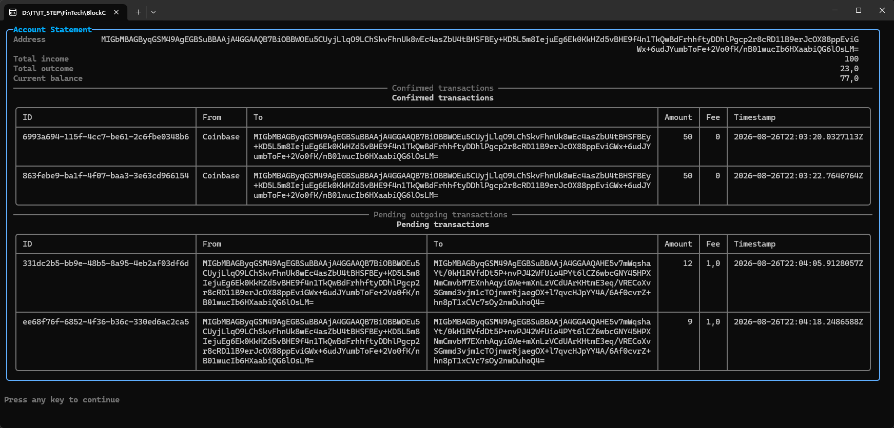
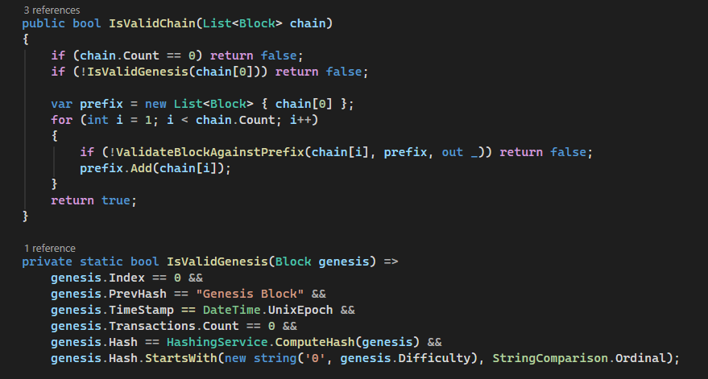
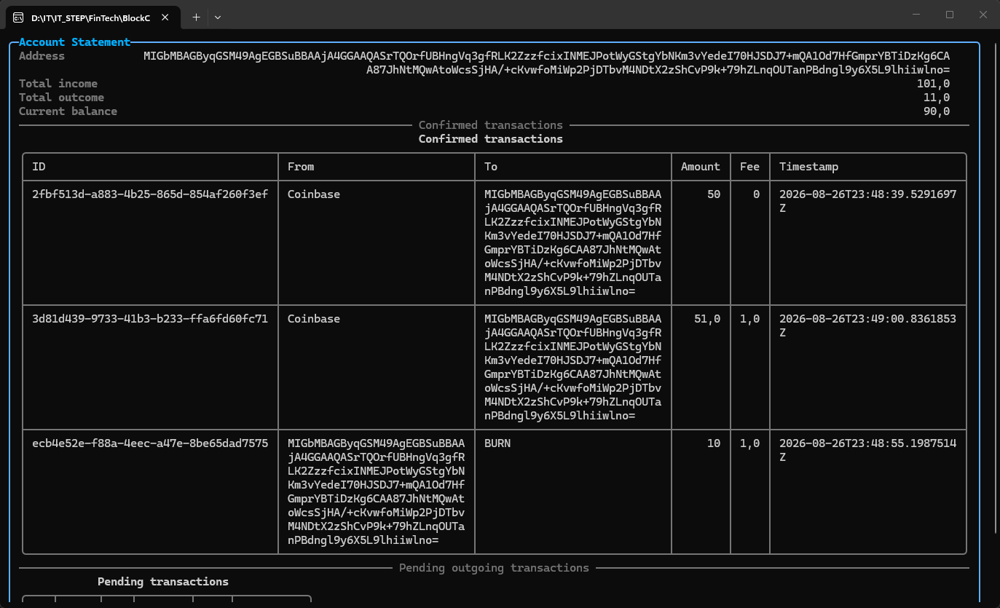
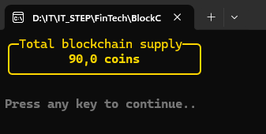

# Домашнє завдання. Блокчейн, частина 6 (Економіка та спалювання монет)

## Рівень 1. Обов'язкова частина (Детальна виписка по рахунку)

Метод GetBalance повертає лише одне число, але користувачам потрібна детальна статистика фінансів.

1. У класі BlockChainDisplayService створіть метод PrintAccountStatement(BlockChainService blockchain, string address).
2. Метод повинен проаналізувати весь ланцюг і вивести в консоль: загальну суму отриманих монет, загальну суму відправлених монет, поточний баланс та загальну кількість транзакцій, у яких брала участь ця адреса.
3. У Program.cs змайніть кілька блоків з транзакціями Аліси і продемонструйте її фінансову виписку на екрані.

## Рівень 2. Захист нульового блоку (Genesis Protection)

Зараз цикл у методі isValid() починається з індексу 1, повністю ігноруючи перевірку нульового блоку (Genesis). Хакер може змінити код Genesis-блоку, додавши туди собі монети, і система цього не помітить.

1. Оновіть метод isValid() у BlockChainService.
2. ПЕРЕД початком циклу додайте окрему перевірку для Chain[0].
3. Перевірте, чи відповідає поточний хеш нульового блоку результату \_hashingService.ComputeHash(Chain[0]).
4. Перевірте, чи є його PrevHash правильним (наприклад, "0" або порожній рядок, як ви задавали при створенні). Якщо хоча б щось не збігається — блокчейн невалідний.

## Рівень 3. Складне завдання на 12 балів (Спалювання монет - Coin Burn)

Багато криптовалют штучно створюють дефляцію: знищують частину монет, щоб ті, що залишилися, стали дорожчими. Це робиться шляхом відправки грошей на спеціальну адресу-чорну діру, до якої немає приватного ключа.

1. Вводимо системне правило: адреса "BURN" є чорною дірою.
2. Оновіть метод ValidateTransaction у TransactionService: жорстко забороніть будь-якій транзакції мати From == "BURN". Ніхто ніколи не зможе витратити ці монети. (Відправляти на To == "BURN" дозволено).
3. Оновіть метод GetTotalSupply(), який ви писали у класній роботі. Формула емісії тепер така: (Сума всіх транзакцій від "SYSTEM") МІНУС (Сума всіх транзакцій на адресу "BURN").
4. У Program.cs продемонструйте спалювання:

- Аліса майнить блок і отримує 50 монет.
- Виведіть TotalSupply (має бути 50).
- Аліса створює транзакцію, де відправляє 10 монет на адресу "BURN". Змайніть цей блок.
- Знову виведіть TotalSupply. Він має стати 40, оскільки 10 монет назавжди виведені з обігу.

## Результати

1. Скріншот консолі з детальною випискою по рахунку Аліси (Рівень 1).

2. Скріншот методу isValid() із доданим захистом Genesis-блоку (Рівень 2).

3. Скріншот консолі з успішним спалюванням монет та зменшенням TotalSupply (Рівень 3).

