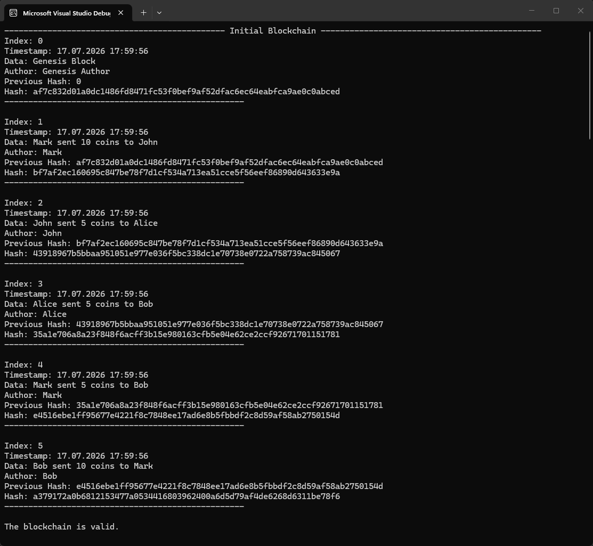
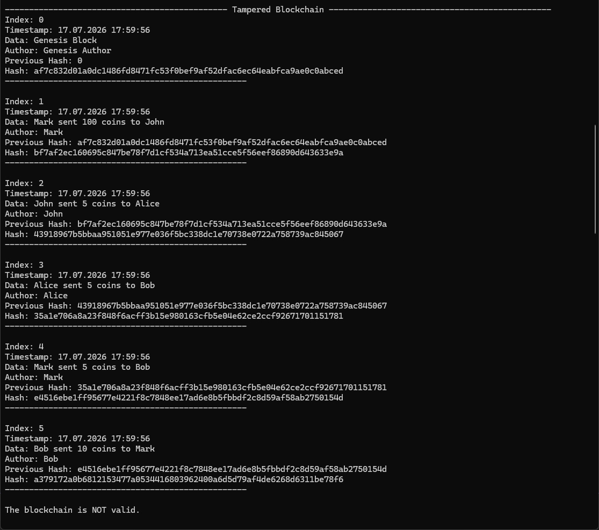
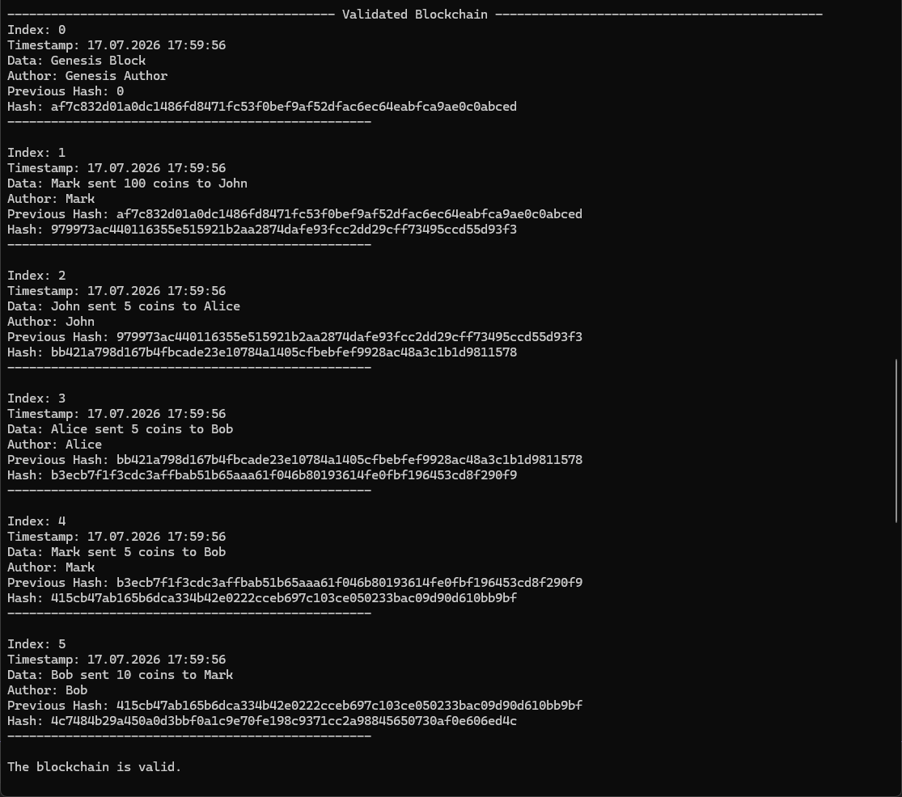
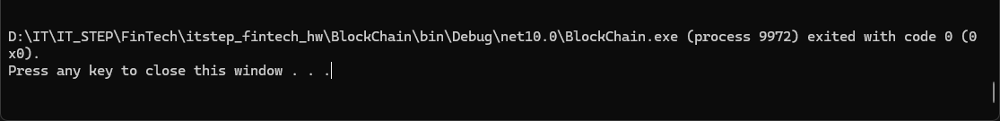

# Домашнє завдання. Блокчейн, частина 1

## Рівень 1. Обов'язкова частина

1. Відтворити проєкт із заняття. Створити класи Block, HashingService, BlockchainService, BlockchainDisplayService.
2. Додати в Program.cs мінімум 3 власні блоки з різними даними.
3. Вивести ланцюг у консоль і перевірити, що IsValid видає true.

## Рівень 2. Додатково

1. Додати в клас Block властивість string Author.
2. Оновити HashingService, щоб метод обчислення хешу враховував нове поле Author.

## Рівень 3. Складне завдання

1. У коді вручну змінити дані у першому створеному блоці.
2. Написати логіку, яка перерахує хеш підробленого блоку та оновить PrevHash у наступного блоку так, щоб перевірка IsValid знову пройшла успішно.

### Що завантажити на перевірку:

Завантажте скріншоти результату роботи програми та посилання на ваш репозиторій у Git.

# Результати

